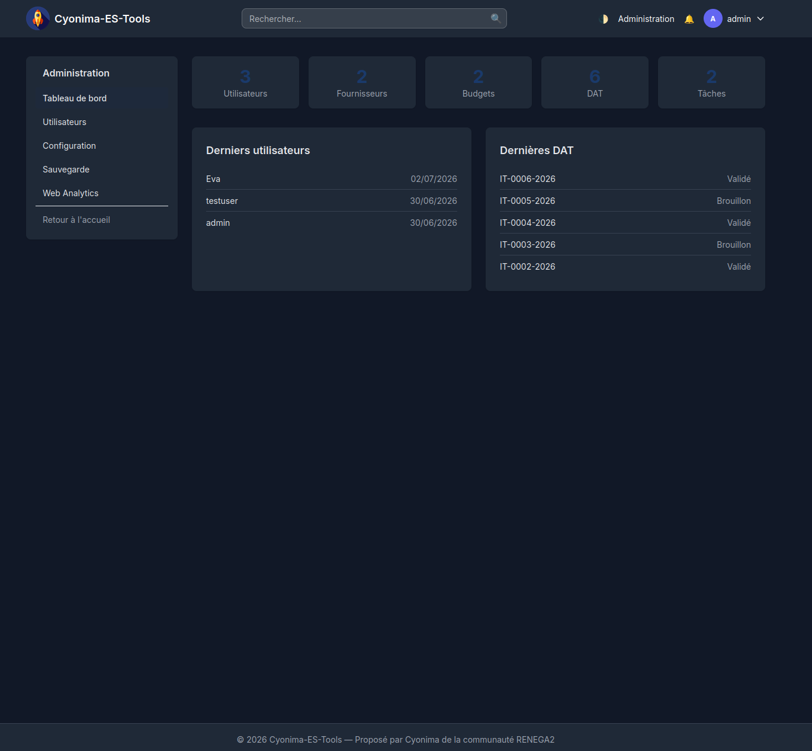
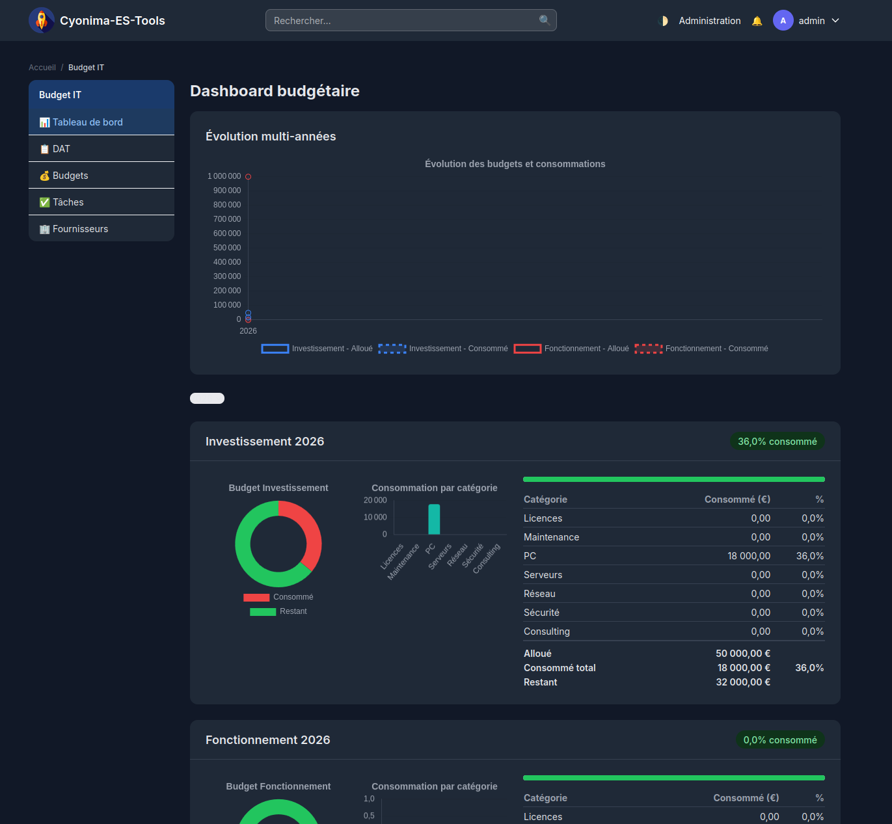
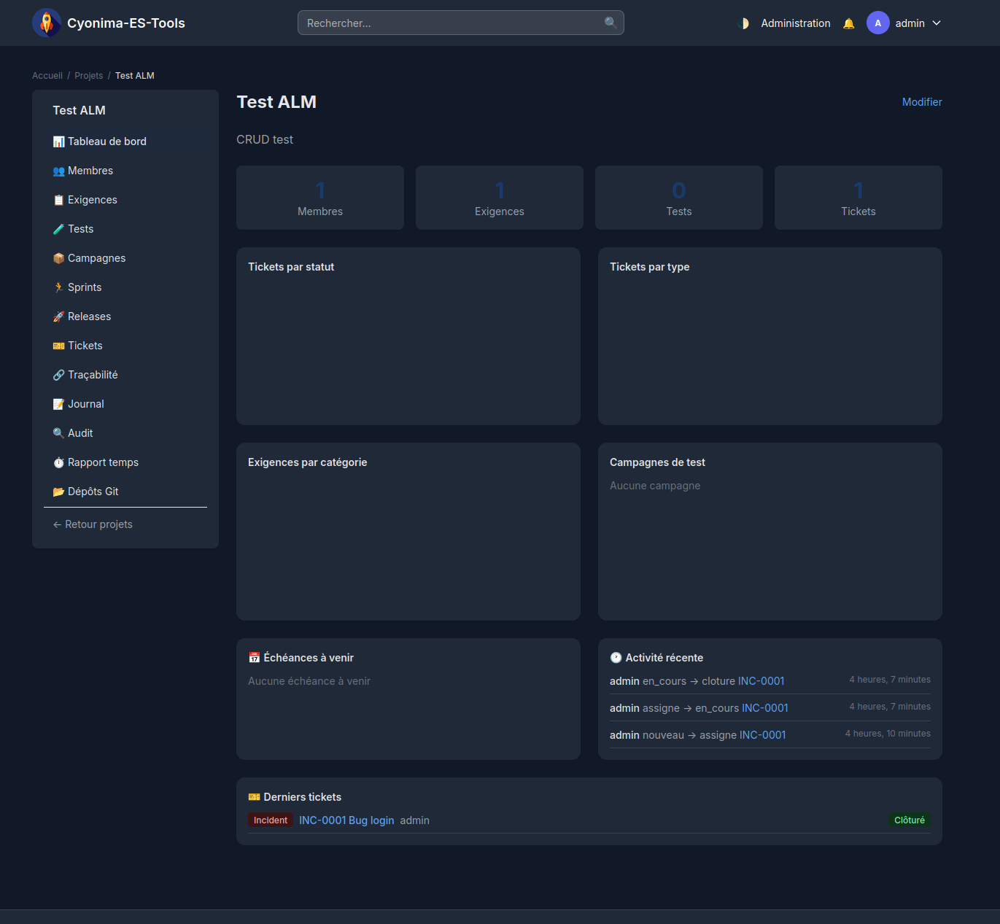
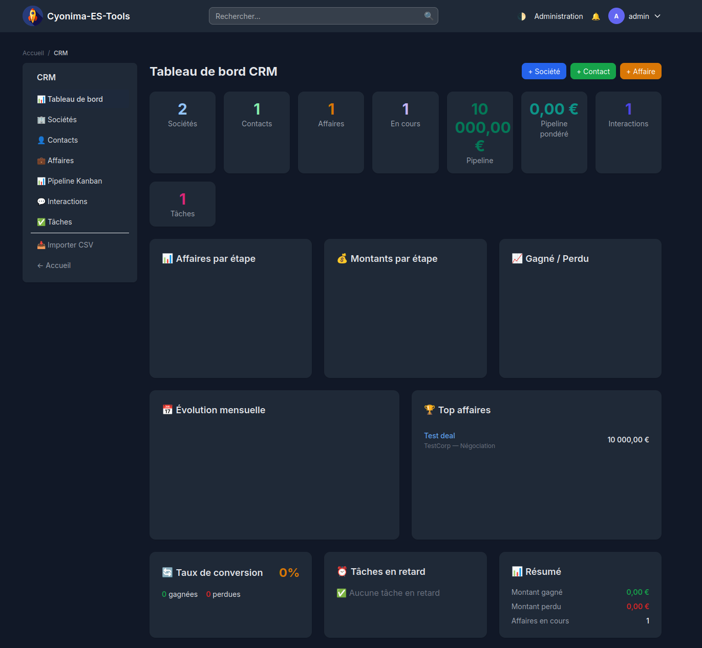
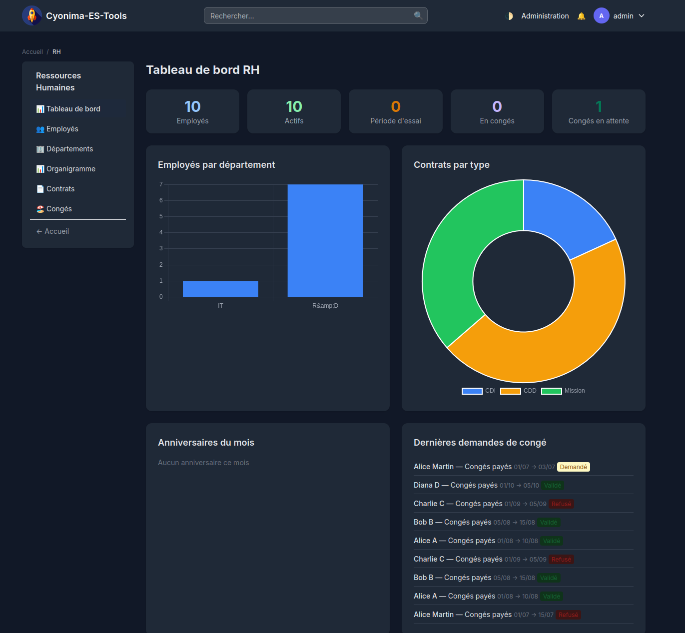
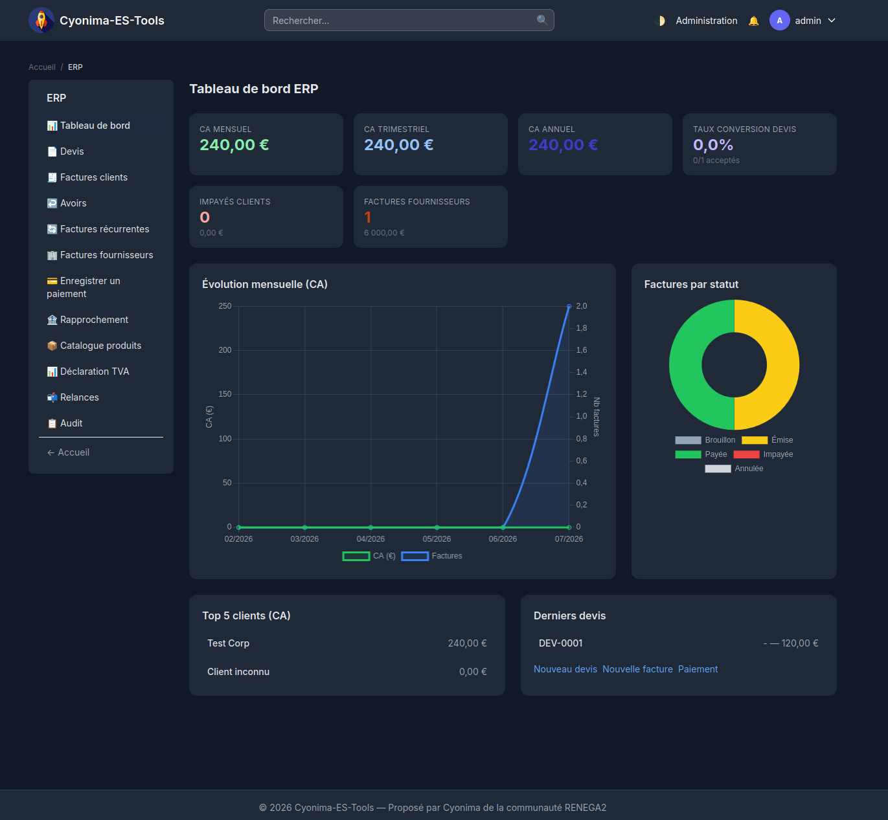
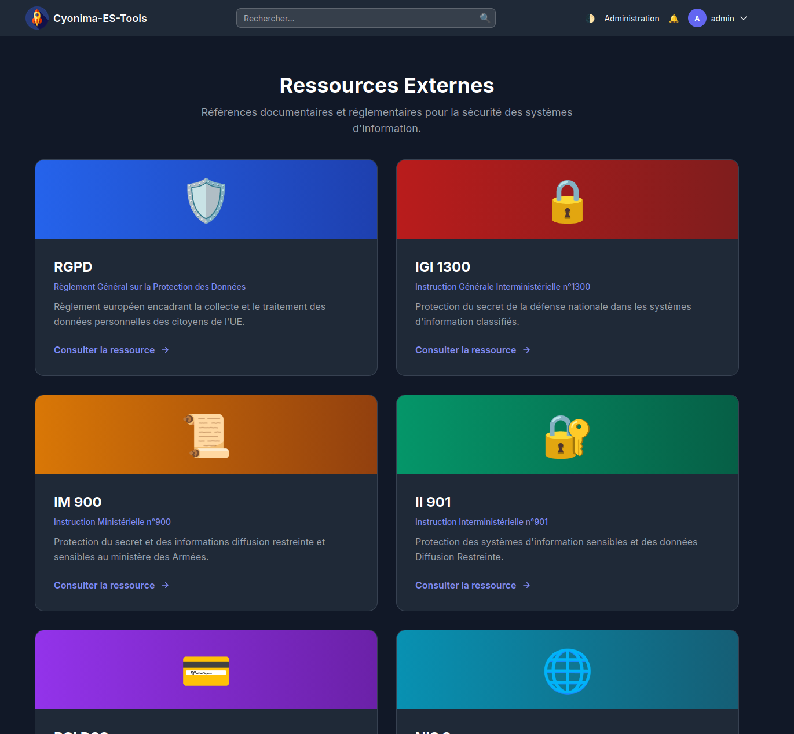

# Documentation utilisateur — Cyonima-ES-Tools

## 1. Authentification

### Connexion
- Page de connexion : `/accounts/login/`
- La double authentification par email (2FA) peut être activée dans le profil utilisateur.

### Déconnexion
- accessible via le menu utilisateur en haut à droite.

---

## 2. Administration (`/administration/`)

Réservé aux membres du staff (`is_staff=True`).

### Utilisateurs
- **Liste** : `/administration/utilisateurs/` — tableau avec rôles multiples.
- **Création** : formulaire avec nom, email, mot de passe, sélection des rôles.
- **Modification** : éditer le profil, activer/désactiver, changer les rôles.
- **Suppression** : confirmation avant suppression.

### Configuration
- **Nom du site** : modifiable depuis `/administration/configuration/`.
- **Logo** : téléversement d'un fichier image.

### Sauvegarde
- `/administration/sauvegarde/` — deux actions :
  - **Télécharger** : génère une archive ZIP contenant un export JSON complet (`dumpdata`), les fichiers médias, et un fichier `version.txt`
  - **Restaurer** : upload d'un fichier ZIP de sauvegarde — vide la base (`flush`), recharge les données (`loaddata`), et remplace les fichiers médias

### Web Analytics
- `/administration/analytiques/` — tableau de bord des visites :
  - Vues totales et visiteurs uniques (7 et 30 jours)
  - Graphique d'évolution quotidienne (Chart.js) — optimisé en 1 requête agrégée
  - Pages les plus visitées
- Les visites sont enregistrées automatiquement via un middleware (hors pages d'administration et statiques).
- **Configuration du site** : singleton (une seule ligne), nom et logo modifiables.

---

## 3. Budget IT (`/budget/`)

### Tableau de bord (`/budget/dashboard/`)
- Graphiques Chart.js :
  - Donut : répartition par type de DAT
  - Barres : montants par type budgétaire
  - Courbe d'évolution : consommation mensuelle et budget restant
  - **Comparaison N/N-1** : barres côte à côte alloué/consommé année précédente vs année en cours
- Alertes budgétaires : seuils à 80 % (orange) et 100 % (rouge).
- **Commande `check_budget_alerts`** : envoie des notifications aux admins et `it_manager` en cas de dépassement.

### DAT — Demandes d'Achat Travaux (`/budget/dat/`)
Les DAT sont identifiées par `IT-XXXX-ANNEE`.

#### Workflow des statuts
1. **Brouillon** : création, modification possible
2. **Soumise** : envoyée pour validation (bouton "Soumettre")
3. **Validée** : approuvée (bouton "Valider")
4. **Rejetée** : refusée (bouton "Rejeter")

#### Fonctionnalités
- Création avec produits multiples (ajout dynamique de lignes)
- Édition, duplication, suppression
- **Export CSV, XLSX (openpyxl), PDF (WeasyPrint)**
- **Modèles de DAT** : sauvegarder/charger des configurations de lignes prédéfinies (bouton 💾).
- Affichage détaillé avec lignes de produits

### Budgets annuels (`/budget/budgets/`)
- CRUD complet : créer, modifier, supprimer des enveloppes budgétaires par année et type.
- Types : Investissement, Fonctionnement.
- Contrôle d'unicité : impossible de créer deux budgets de même type pour la même année.
- Validation côté serveur : conversion sécurisée des montants (Decimal).

### Tâches / Todo (`/budget/taches/`)
- Kanban avec 3 colonnes : À faire, En cours, Terminé.
- Glisser-déposer (drag & drop) via fetch pour changer le statut.
- Couleurs selon l'échéance :
  - Vert : > 7 jours
  - Jaune : 3-7 jours
  - Orange : 1-3 jours
  - Rouge : aujourd'hui ou dépassé
- Création rapide, suppression.
- Robustesse : `JSONDecodeError` intercepté sur mise à jour statut.

### Fournisseurs (`/budget/fournisseurs/`)
- CRUD complet : entreprise, contact, téléphone, email, description.
- Protection `ProtectedError` si suppression d'un fournisseur lié à des DAT.

---

## 4. Guichet IT (`/guichet/`)

Portail de tickets d'incidents et d'expressions de besoins (EBI).

### Types de tickets
| Type | Préfixe | Workflow |
|------|---------|----------|
| **Incident** | `INC-XXXX` | nouveau → en_cours → resolu → ferme |
| **EBI** | `EBI-XXXX` | nouveau → en_etude → valide → realise → ferme |

### Fonctionnalités
- **Liste** : filtre par type (Incidents / EBI) avec onglets.
- **Création** : formulaire avec type, titre, description, assignation.
- **Détail** : affichage complet, historique des transitions, formulaire de transition.
- **Transitions** : changement de statut avec commentaire optionnel, journalisé dans l'historique.

---

## 5. ALM — Gestion de projet (`/projects/`)

Module de cycle de vie applicatif complet : exigences, tests, campagnes, tickets, sprints.

### Projets
- CRUD de projets.
- Membres avec rôles : Chef de projet, Développeur, Testeur, Intégrateur.
- Accès restreint aux membres + administrateurs.
- **Tableau de bord enrichi** : 4 compteurs (membres, exigences, tests, tickets), 3 graphiques Chart.js (tickets par statut, tickets par type, exigences par catégorie), campagnes de test, échéances à venir, activité récente, derniers tickets.

### Exigences
- Arborescence avec dossiers parents et sous-exigences.
- **Liste** : recherche texte, filtre par catégorie, vue arborescente.
- **Détail** (`/exigences/<id>/`) : informations complètes, dossier parent cliquable, upload de pièces jointes, liste des tests liés.
- **Création** : type, dossier parent, nom, description.
- **Dossier** : création via modal depuis la liste (Nouveau dossier).
- **Export CSV** : toutes les exigences du projet.
- **Import CSV** : colonnes `nom`, `categorie`, `description`, `parent` (numéro de dossier).
- **Traçabilité** : matrice reliant exigences et scénarios de test.

### Tests
- Scénarios de test avec étapes (action → résultat attendu).
- **Liste** : recherche texte, filtre par exigence liée, pagination.
- **Exécution** (`/tests/<id>/executer/`) : formulaire pas-à-pas avec statut par étape (Réussi/Échec/Bloqué), résultat global, notes. Historique des exécutions.
- **Export CSV** : tous les scénarios avec leurs étapes.
- **Import CSV** : colonnes `nom`, `type`, `description`, `assigne`, `echeance`.

### Campagnes de test
- Regroupement de tests avec statut de progression.
- **Kanban** : colonnes Backlog → En cours → Vérifié → Validé avec drag-and-drop (SortableJS + AJAX).
- **Rapport** : compteurs par statut, détail des tests.
- **Export CSV** : tests d'une campagne avec statut et position.

### Tickets
3 types avec workflows distincts :

| Type | Préfixe | Workflow |
|------|---------|----------|
| **Incident** | `INC-XXXX` | nouveau → assigne → en_cours → cloture |
| **Tâche** | `TCH-XXXX` | nouveau → assigne → en_cours → valide → cloture |
| **FT** | `FT-XXXX` | nouveau → assigne → en_cours → valide → a_clore → cloture |

Vues disponibles :
- **Liste** : filtres par type (onglets), statut, assigné, recherche texte, pagination.
- **Kanban** : colonnes par statut avec **drag-and-drop** (SortableJS + AJAX), mise à jour en temps réel.
- **Gantt** : timeline avec dates de début/échéance.
- **Détail** : transitions avec suivi du temps (heures passées), commentaires, historique complet.
- **Édition** (`/tickets/<id>/modifier/`) : modifier titre, description, assignation, dates.
- **Pièces jointes** : upload de captures/fichiers dans le détail du ticket.
- **Temps passé** : cumul des heures saisies à chaque transition, affiché dans le détail.
- **Export CSV** : tous les tickets du projet.
- **Import CSV** : colonnes `titre`, `type`, `description`, `assigne` (username), `echeance` (YYYY-MM-DD).
- **Notifications automatiques** : lors de l'assignation, du changement de statut (pour la personne assignée).
- **Échéances** : commande `notify_deadlines` pour notifier les tickets à échéance J+2.
- **Liaison commit de clôture** : lors du passage au statut "cloture", possibilité de saisir un hash de commit Git et un dépôt associé. Le commit lié s'affiche dans le détail du ticket avec un lien vers sa page de détail dans le dépôt. La liaison peut aussi être faite ou retirée depuis l'édition du ticket ou directement sur la page détail.

### Sprints
- Modèle Sprint (nom, description, dates début/fin, actif/inactif).
- **Liste** : tous les sprints du projet avec barre de progression.
- **Détail** : tickets du sprint, compteurs par statut, **burndown chart** (Chart.js).
- **Ajout de tickets** : sélection multiple depuis la liste des tickets disponibles.

### Releases
- Modèle Release (nom, version, description, date de sortie, publiée/en cours).
- **Liste** : barre de progression, compteur tickets clôturés/total.
- **Détail** : tickets de la release, ajout multiple de tickets.
- Lien dans le menu latéral.

### Journal
- Comptes rendus d'activité manuscrits.
- **Liste** : recherche dans le contenu, pagination.

### Audit (journal des modifications)
- Modèle `AuditLog` enregistrant automatiquement : créations, modifications, suppressions, changements de statut.
- **Liste** : filtres par action et type d'entité, pagination.
- Hooks dans : création/changement de statut/édition/kanban des tickets.
- Lien "Audit" dans le menu latéral.

### Rapports
- **Rapport temps** : heures passées par utilisateur et type de ticket (`/rapports/temps/`). Filtres par date et utilisateur. Graphiques Chart.js (barres par utilisateur, donut par type).

### Dépôts Git
- Module intégrant le suivi de dépôts git distants directement depuis l'interface ALM.
- **Liste** : tous les dépôts du projet, avec statut valide/invalide.
- **Création** : URL distante (clone automatique) ou chemin local si déjà cloné.
- **Détail** : infos du dépôt, branches, tags, commits récents, actions Pull/Fetch.
- **Commits** : historique avec filtre par branche et chemin de dossier.
- **Détail commit** : message, auteur, diff des fichiers modifiés.
- **Arborescence** : navigation dans les fichiers/dossiers du dépôt, par branche/tag.
- **Contenu fichier** : affichage avec breadcrumb de navigation.
- **Contributeurs** : classement par nombre de commits avec barre de progression proportionnelle.
- **Suppression** : supprime le modèle (ne touche pas au disque).

### Notifications
- Module transverse avec cloche 🔔 dans la barre de navigation (badge avec compteur de notifications non lues).
- Notifications **in-app** créées automatiquement sur :
  - Assignation d'un ticket
  - Changement de statut d'un ticket assigné
  - Échéance approchante (via commande `notify_deadlines`)
- Page de liste : `/notifications/` avec lecture/tri.

---

## 6. Blogs (`/blog/*/`)

Cinq blogs accessibles selon le rôle :

| Blog | URL | Rôle écriture | Lecture |
|------|-----|---------------|---------|
| Sécurité | `/blog/securite/` | `security_officer` ou `admin` | Tous |
| Direction | `/blog/direction/` | `direction` ou `admin` | Tous |
| Communication | `/blog/communication/` | `communication` ou `admin` | Tous |
| IT | `/blog/it/` | `it_manager` ou `admin` | Tous |
| Rep. Syndicale | `/blog/representation-syndicale/` | `elus_syndicaux` ou `admin` | Tous |

### Page d'accueil (`/blog/`)
- Grille présentant les 5 blogs avec leurs icônes, descriptions et 3 derniers articles.

### Liste des articles
- Affichage complet des articles (titre, image à la une, contenu, métadonnées) les uns en dessous des autres.
- Barre latérale : 30 derniers articles, lien "Tous les articles", bouton "Nouvel article".
- **Recherche** plein texte dans le titre et le contenu des articles.
- **Pagination** : 15 articles par page avec navigation précédent/suivant.
- **Tags** : nuage de tags filtrables, badges sur les articles.
- **Brouillon / Publié** : workflow de publication. Les brouillons sont masqués aux non-auteurs (badge orange).

### Édition d'articles
- Création et modification avec éditeur de texte riche (CKEditor 5) — mise en forme HTML (titres, gras, listes, etc.).
- Possibilité d'ajouter une image à la une.
- **Pièces jointes PDF** : upload fonctionnel, stocké dans le modèle ArticleAttachment.
- Suppression avec confirmation.
- **Sécurité** : contenu HTML assaini (sanitizer BeautifulSoup) avant sauvegarde.
- **Notification** in-app créée pour l'auteur lors de la publication.

---

## 7. Wiki (`/wiki/`)

Documentation collaborative accessible à tous les utilisateurs connectés.

### Layout
- **Sidebar** : barre de recherche, bouton "Nouvelle page", index alphabétique complet de toutes les pages (scrollable).
- Page active surlignée en bleu dans l'index.

### Fonctionnalités
- **Liste** : toutes les pages avec recherche plein texte (titre + contenu), compteur de pages.
- **Détail** : breadcrumb, boutons Modifier/Supprimer, **sommaire automatique** extrait des titres h2/h3, typographie wiki enrichie (bordures, blockquotes, code, tableaux).
- **Création/Modification** : titre et contenu saisis avec CKEditor 5 (éditeur WYSIWYG), langue FR.
- **Suppression** : confirmation avant suppression.
- **Slugs** : génération automatique à partir du titre avec gestion des doublons.
- **Historique / Versioning** : chaque modification sauvegarde la version précédente. Liste des versions, bouton "Restaurer".
- **Pièces jointes** : upload de fichiers attachés aux pages wiki.
- **Liens internes `[[ ]]`** : syntaxe wiki `[[Titre de page]]` convertie en lien automatique.
- **Sécurité** : contenu HTML assaini (sanitizer BeautifulSoup — suppression scripts, iframes, javascript:).

---

## 8. CRM — Gestion de la Relation Client (`/crm/`)

Module de gestion commerciale avec pipeline de ventes.

### Tableau de bord enrichi (`/crm/dashboard/`)
- **7 indicateurs KPI** : sociétés, contacts, affaires, affaires actives, valeur du pipeline, interactions, tâches.
- **Pipeline pondéré** : KPI supplémentaire calculé comme Σ(montant × probabilité).
- **3 graphiques Chart.js** :
  - Barres : répartition des affaires par étape.
  - Donut : montant total par étape.
  - Donut : affaires gagnées / perdues.
- **Courbe d'évolution mensuelle** (dual axis) : nombre d'affaires et montant cumulé par mois.
- **Top 5 affaires** par montant, taux de conversion (gagné / total clôturé).
- **Boutons d'action rapide** : nouvelle société, nouveau contact, nouvelle affaire, nouvelle interaction, nouvelle tâche.

### Sociétés
- Fiche complète (coordonnées, SIRET, secteur).
- Liste avec nombre de contacts et d'affaires, bouton d'export CSV.
- Détail avec contacts et affaires liés.
- **Timeline unifiée** : fusionne interactions, changements d'étape d'affaires, devis et factures ERP en une chronologie.
- **Export PDF** : bouton 🖨️ pour générer une fiche synthétique (WeasyPrint).

### Contacts
- Prénom, nom, société, fonction, coordonnées, notes.
- Liste avec bouton d'export CSV.

### Affaires (Deals)
- Pipeline avec étapes : Prospection → Devis → Négociation → Gagné / Perdu.
- Montant, probabilité, date de clôture prévue.
- **Page détail enrichie** : historique des changements d'étape, pièces jointes (upload/visualisation/suppression), timeline d'activité, création de devis ERP.
- Les titres dans la liste des affaires sont des liens vers la page de détail.
- Bouton d'export CSV sur la liste.

### Interactions
- Historique des appels, emails, réunions et notes liés à un contact/affaire.
- Filtrable par contact ou affaire.

### Tâches (CrmTask)
- Todo liées à un contact ou une affaire, avec assignation, échéance (colorisée), marquage terminé/à faire.
- **Rappels** : `reminder_date` et `reminder_sent` sur chaque tâche, affichés dans le tableau.
- Création : `/taches/creer/`
- Modification : `/taches/<pk>/modifier/`

### Pièces jointes (Attachments)
- Modèle `CrmAttachment` lié aux affaires et interactions.
- Upload sur la page détail d'une affaire.
- Visualisation et suppression inline via `serve_attachment` (streaming `FileResponse`) et `delete_attachment`.
- URLs : `/crm/pj/<pk>/` et `/crm/pj/<pk>/supprimer/`

### Export CSV
- Pages d'export dédiées : `/crm/exporter/societes/`, `/crm/exporter/contacts/`, `/crm/exporter/affaires/`
- Boutons CSV sur les listes sociétés, contacts et affaires.
- Fichiers générés en UTF-8 avec BOM pour compatibilité Excel.

### Import CSV
- Vue `import_csv` à l'URL `/crm/importer/`
- Un seul fichier peut contenir des sociétés et des contacts — auto-détection du format par les en-têtes CSV.
- Template avec exemples de format affichés.
- Lien dans la barre latérale CRM.

### CRM → ERP (Devis)
- Le modèle `Quotation` (ERP) possède un champ `deal` (ForeignKey) — migration `erp/0002`.
- Un bouton "Créer un devis" sur la page détail d'une affaire appelle la vue `deal_create_quotation`.
- Le devis créé affiche un lien vers l'affaire source.

### Migrations CRM appliquées
| Migration | Contenu |
|-----------|---------|
| `crm/0002_add_reminder_to_task` | Champs `reminder_date` (DateTimeField) et `reminder_sent` (BooleanField) sur `CrmTask` |
| `crm/0003_add_stage_log` | Modèle `DealStageLog` (from_stage, to_stage, changed_by, changed_at) |
| `crm/0004_add_attachment` | Modèle `CrmAttachment` lié à Deal et Interaction |

### ERP migration appliquée
| Migration | Contenu |
|-----------|---------|
| `erp/0002_add_deal_to_quotation` | Champ `deal` (ForeignKey) sur `Quotation` |

---

## 9. RH — Ressources Humaines (`/rh/`)

Gestion administrative du personnel.

### Fonctionnalités
- **Tableau de bord** : effectif, actifs, essais, congés en cours, demandes en attente, graphiques (employés par département, contrats par type), anniversaires du mois, dernières demandes de congé.
- **Employés** : fiche complète (coordonnées, département, poste, **grade Ccn. Métallurgie A1–I18**, société prestataire, statut, date d'embauche, contact d'urgence, notes). Consultation des contrats et congés liés.
- **Départements** : liste avec nombre d'employés, description, **responsable** (manager assignable).
- **Organigramme** : vue hiérarchique par département avec avatars et postes.
- **Contrats** : CDI, CDD, mission, stage, alternance, freelance, intérim — avec dates, salaire, poste. Colorisation par échéance (vert >3mo, jaune 1-3mo, orange <1mo, rouge expiré/semaine). CDI toujours vert.
- **Congés** : demandes avec workflow de validation (demandé → validé / refusé). Types : CP, RTT, maladie, maternité, sans solde, formation. Affichage du nombre de jours. Calendrier mensuel avec navigation, affichage par initiales colorées. Détection de conflits (chevauchement dans le même département).

### Profil employé (`/rh/profil/`)
- Page personnelle de l'employé connecté accessible via le menu utilisateur.
- Six onglets :
  1. **Diplômes** : niveau (BEPC→Doctorat), nom, école, année, fichier
  2. **Certifications** : nom, organisme émetteur, année, fichier
  3. **Formations** : nom, organisme de formation, année, fichier
  4. **Emplois** : titre, employeur, description (TexteArea), dates, durée calculée automatiquement
  5. **CV** : upload PDF (validation extension + content-type), visualisation dans un `<iframe>` intégré
  6. **Évaluations** : année, note (1-5 colorisée : ≤1 rouge, 2-3 jaune, 4-5 vert), commentaire

### Permissions RH
- **Lecture seule** (tableau de bord, listes, détail) : tous les utilisateurs staff (`@staff_member_required`)
- **Écriture** (création, modification, suppression, validation) : `hrbp` ou `admin` (`@hrbp_or_admin_required`)
- **Salaires** : visibles uniquement par `hrbp` et `admin` (masqués pour les autres)
- Les notes d'évaluation sont saisies par les HRBP ; les employés voient leurs propres évaluations en lecture seule

---

## 10. ERP — Devis et Factures (`/erp/`)

Module de gestion comptable avec devis, factures, avoirs et paiements.

### Identifiants
| Document | Préfixe | Exemple |
|----------|---------|---------|
| Devis | `DEV-{seq:04d}` | `DEV-0042` |
| Facture | `FACT-{seq:04d}` | `FACT-0018` |
| Avoir | `AVOIR-{seq:04d}` | `AVOIR-0003` |
| Facture fournisseur | `FACF-{seq:04d}` | `FACF-0007` |

### Fonctionnalités
- **Tableau de bord** : CA mensuel, trimestriel et annuel, impayés, donut par statut.
- **Devis → Facture** : conversion en un clic depuis le détail du devis.
- **Lignes** : chaque document contient des lignes (description, quantité, prix unitaire, TVA) stockées en JSON.
- **Paiements** : validation que le montant ne dépasse pas le restant dû.
- **Avoirs** : documents de correction liés à une facture.
- **Factures fournisseurs** : suivi des factures reçues.
- **Factures récurrentes** : génération automatique périodique (mensuelle, trimestrielle, annuelle). Commande `generate_recurring`.
- **Modèles de devis** : sauvegarder/charger des lignes prédéfinies (bouton 💾).
- **Rapprochement bancaire** : associer les paiements non liés aux factures impayées.
- **Produits** : catalogue de produits/services enregistré dans l'admin Django.
- **Sécurité** : données JSON protégées (`json_script`), calculs en `Decimal`, numérotation thread-safe.

---

## 11. GED — Gestion Électronique de Documents (`/ged/`)

Module de classement, recherche et téléchargement de fichiers avec catégories, tags, workflow de validation et versionnage automatique.

### Catégories
- **Catégories colorées** : 11 catégories pré-générées (RH, Juridique, Finances, IT, Commercial, Procédures, Formation, Qualité, Direction, Projets, Communication).
- **Gestion CRUD** par le staff via `/ged/categories/` (lien dans le sidebar).
- **Suppression** : avertit du nombre de documents qui deviendront orphelins.
- **Filtre** en haut de la liste des documents par catégorie.
- **Abonnements** 🔔/🔕 : s'abonner à une catégorie directement depuis le sidebar pour suivre les nouveaux documents.

### Recherche
- **Plein texte** : recherche dans le titre, la description, les tags et le contenu extrait (PDF/DOCX/TXT).
- **Filtres combinables** : par catégorie, par statut, par favoris (`?fav=1`).
- **Réindexation** : commande `python3 manage.py ged_reindex` pour réextraire le texte de tous les documents.

### Workflow de validation
| Statut | Description |
|--------|-------------|
| **Brouillon** | Document en cours de rédaction, modifiable |
| **En relecture** | Soumis pour approbation (bouton "Soumettre") |
| **Publié** | Approuvé par un membre du staff (bouton "Approuver") |
| **Archivé** | Document historique, masqué de la liste par défaut |

Actions disponibles : publier, archiver, désarchiver. Seuls les membres du staff peuvent approuver.

### Versionnage automatique
- À chaque modification du fichier, l'ancien fichier est conservé comme **version précédente** dans `DocumentVersion`.
- **Historique** visible sur la fiche document : fichier, taille, téléchargeur, date, notes.
- **Restauration** possible d'une version précédente avec sauvegarde de la version courante au préalable.

### Favoris ⭐
- Bouton ☆/★ sur chaque fiche document pour l'ajouter/retirer des favoris.
- Page `/ged/mes-favoris/` listant tous les favoris avec retrait possible.
- Filtre `?fav=1` dans la liste des documents pour n'afficher que les favoris.

### Corbeille 🗑
- Suppression → déplacement dans la corbeille (soft-delete avec `deleted_at`).
- Page `/ged/corbeille/` : liste des documents supprimés avec date.
- Actions : **Restaurer** (retour dans la liste) ou **Supprimer définitivement** (fichier + base).

### Partage par lien 🔗
- Génération d'un lien public avec expiration configurable (1/7/30 jours).
- Page publique `/ged/partage/<uuid:token>/` sans authentification.
- Téléchargement direct depuis la page de partage.
- Consultation et révocation des liens actifs depuis la fiche document.
- Lien expiré → page d'erreur dédiée.

### Rapport d'audit 📋
- Journalisation de 12 types d'actions : création, modification, suppression, restauration, suppression définitive, soumission, approbation, archivage, désarchivage, restauration de version, partage, téléchargement.
- Page `/ged/rapport-audit/` : tableau complet avec date, document, action, utilisateur, IP.
- Mini journal intégré sur chaque fiche document (50 dernières entrées).

### Upload glisser-déposer
- Zone de dépôt avec Alpine.js : drag & drop ou clic pour sélectionner.
- Aperçu du nom et de la taille du fichier après sélection.
- Fonctionne aussi sur le formulaire d'édition.

### Autres fonctionnalités
- **Numérotation** automatique : `DOC-{année}-{seq:05d}`.
- **Upload multiple** : sélectionner plusieurs fichiers d'un coup (input `multiple`).
- **Date d'expiration** : champ `expiry_date` par document, commande `check_expiry` pour alertes J-30.
- **Tags** libres pour un classement transversal.
- **Prévisualisation** des images et PDF.
- **Téléchargement** avec compteur automatique.

---

## 12. Ressources Externes (`/ressources/`)

Pages d'information statiques sur les principales réglementations SSI.

### Pages disponibles
| Ressource | Description |
|-----------|-------------|
| **RGPD** | Règlement Général sur la Protection des Données (UE) 2016/679 |
| **IGI 1300** | Instruction Générale Interministérielle — protection du secret de la défense nationale |
| **IM 900** | Instruction Ministérielle — protection du secret au ministère des Armées |
| **II 901** | Instruction Interministérielle — protection des SI diffusion restreinte |
| **PCI DSS** | Payment Card Industry Data Security Standard (v4.0) |
| **NIS 2** | Directive européenne sur la sécurité des réseaux et des systèmes d'information |
| **EBIOS RM** | Méthode française d'analyse des risques SSI (ANSSI) |
| **IEC 62443** | Cybersécurité des systèmes industriels et ICS |
| **ISO 27001** | Management de la sécurité de l'information (SMSI) |
| **ISO 27032** | Lignes directrices pour la cybersécurité |
| **Conv. Métallurgie** | Convention Collective Nationale de la Métallurgie — classification A1 à I18, grille SMH, prime d'ancienneté, préavis, protection sociale |

### Navigation
- Page d'accueil : grille de toutes les ressources disponibles.
- Chaque page contient un sommaire avec ancres, un bandeau coloré, et des sections détaillées.
- Retour facile à la liste via le lien en bas de page.
- Lien "Ma convention collective" dans le menu utilisateur déroulant pour un accès rapide.

---

## 13. COMEX (`/comex/`)

Forum d'échange réservé à la direction et aux administrateurs.
- Création de fils de discussion.
- Réponses dans les fils.
- Accès : rôle `direction` ou `admin`.

---

## 14. Notifications

- Cloche 🔔 dans la barre de navigation (badge avec compteur de notifications non lues).
- **Page de liste** : `/notifications/` avec recherche, lecture individuelle, **bouton "Tout marquer comme lu"** (POST).
- **Page de préférences** : `/notifications/preferences/` — configurer quelles notifs recevoir par email.
- **Envoi email** : branché via `django.core.mail` pour les utilisateurs ayant activé les préférences.
- **Messages** : styles distincts pour erreur (rouge), succès (vert), avertissement (ambre), info (bleu), debug (gris).
- **Digest quotidien** : commande `daily_digest` pour envoyer un résumé journalier par email.
- Création automatique à la publication d'articles, assignation de tickets, changement de statut.
- Commandes : `notify_deadlines` (échéances tickets), `check_budget_alerts` (seuils budget), `check_expiry` (documents GED).

---

## 15. Rôles et permissions

| Code rôle | Accès |
|-----------|-------|
| `admin` | Tout — accès administration, tous blogs, COMEX, projets, RH (écriture + salaires) |
| `it_manager` | Budget IT, Guichet IT, blog IT |
| `direction` | Blog direction, COMEX |
| `security_officer` | Blog sécurité |
| `communication` | Blog communication |
| `hrbp` | RH (écriture, validation congés, salaires, évaluations) |
| `elus_syndicaux` | Blog Rep. Syndicale (écriture) |
| `user` | Accès de base (navigation, lecture blogs) |

Un utilisateur peut avoir **plusieurs rôles simultanément**.

---

## 16. Double authentification (2FA)

1. L'utilisateur active la 2FA dans son profil.
2. À la connexion, un code à 6 chiffres est envoyé par email.
3. Le code est valable 5 minutes.
4. Saisie du code sur la page de vérification avant accès à l'application.

---

## 17. Sécurité

- **SECRET_KEY** : variable d'environnement obligatoire (pas de fallback).
- **Production** : `CSRF_COOKIE_SECURE`, `SESSION_COOKIE_SECURE`, `HSTS`, `SSL_REDIRECT` activés automatiquement hors DEBUG.
- **Sanitizer HTML** : filtre BeautifulSoup sur le contenu wiki et blogs (suppression `<script>`, `<iframe>`, `javascript:`, attributs `on*`).
- **CSRF** : token sur tous les formulaires et requêtes AJAX (kanban CRM, kanban tickets).
- **POST obligatoire** : actions de mutation (validation congés, suppressions RH, marquage notifs).
- **robots.txt** : `Disallow: /` pour bloquer les crawlers.
- **Protection** : `ProtectedError` sur suppression fournisseur, validation montant paiement ERP.

---

## 18. Interface utilisateur

### Recherche globale
- Barre de recherche dans la navbar (🔍), interroge 10+ modèles (Wiki, GED, CRM, RH, ERP, Budget, Tickets).
- Page de résultats `/recherche/` avec icônes par type et liens.

### Dark mode
- Toggle 🌓 dans la navbar, persistance `localStorage`, activé par défaut.
- Tous les dashboards Chart.js, tableaux, cartes et sidebars adaptés.

### Page d'accueil
- Fil d'activité à gauche : 10 derniers événements (wiki, documents, articles, tickets) avec horodatage.
- Tuiles de navigation avec `loading="lazy"`.

### Breadcrumbs
- Navigation hiérarchique sur tous les modules (ALM, CRM, ERP, RH, GED, Budget, Wiki).

### Sidebar
- Icônes emoji uniformisées sur les 8 sidebars (📊👥📋🧪📦🏃🚀🎫🔗📝🔍⏱️📂💼💬✅🏖️📄🧾↩️💳🏢📁➕).

### Format monétaire
- Tous les montants au format financier français (séparateur milliers : espace, décimal : virgule).
- Filtre `format_money` sur 70+ expressions dans 35 templates.
