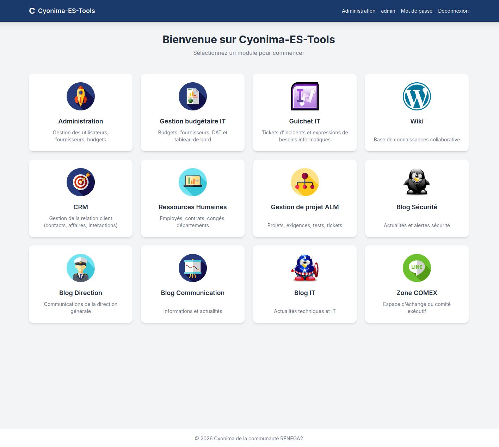

# Cyonima-ES-Tools

<p align="center">
  
</p>

[](https://github.com/LudovicBoudi/Cyonima-ES-Tooling/pkgs/container/cyonima-es-tooling)
[](https://github.com/LudovicBoudi/Cyonima-ES-Tooling/discussions)
[](https://codespaces.new/LudovicBoudi/Cyonima-ES-Tooling)

Plateforme web modulaire pour la gestion IT, le suivi de projet ALM, la communication interne et le helpdesk en Français proposé par Cyonima de la communauté RENEGA2.

## Modules

| Module | Description | Accès |
|--------|-------------|-------|
| **Administration** | Gestion des utilisateurs, rôles, configuration, sauvegarde/restauration | `/administration/` |
| **Budget IT** | Budgets annuels, DAT, fournisseurs, tâches, tableau de bord | `/budget/` |
| **Guichet IT** | Tickets d'incidents et expressions de besoins informatiques | `/guichet/` |
| **ALM** | Projets, exigences, tests, tickets (incidents/tâches/FT) | `/projects/` |
| **Blogs** | Sécurité, direction, communication, IT, représentation syndicale | `/blog/*/` |
| **Wiki** | Pages de documentation collaborative | `/wiki/` |
| **CRM** | Gestion de la relation client (contacts, sociétés, affaires) | `/crm/` |
| **RH** | Ressources Humaines (employés, contrats, congés, diplômes, formations, CV, évaluations) | `/rh/` |
| **ERP** | Devis, factures, avoirs, paiements, factures fournisseurs | `/erp/` |
| **GED** | Gestion électronique de documents (catégories, workflow validation, versionnage, favoris, corbeille, partage, audit) | `/ged/` |
| **Ressources Externes** | Références réglementaires (RGPD, IGI 1300, PCI DSS, NIS 2, Convention Métallurgie…) | `/ressources/` |
| **COMEX** | Forum d'échange du comité exécutif | `/comex/` |
| **Configuration** | Nom du site, logo, HTTPS (redirection + HSTS) | `/administration/configuration/` |

## Captures d'écran

<p align="center">
  
  
  
  
  
  
  
</p>

## Prérequis

- Python 3.12+
- pip (ou venv)

## Installation rapide (Docker, recommandé)

> L'image est automatiquement buildée et publiée sur [ghcr.io](https://github.com/LudovicBoudi/Cyonima-ES-Tooling/pkgs/container/cyonima-es-tooling) à chaque push.
> Pour télécharger l'image manuellement : `docker pull ghcr.io/ludovicboudi/cyonima-es-tooling:latest`

```bash
# 1. Créer le dossier et télécharger les fichiers de configuration
mkdir cyonima && cd cyonima
curl -O https://raw.githubusercontent.com/LudovicBoudi/Cyonima-ES-Tooling/main/docker-compose.yml
curl -O https://raw.githubusercontent.com/LudovicBoudi/Cyonima-ES-Tooling/main/.env.example

# 2. Configurer l'environnement
mv .env.example .env
echo "SECRET_KEY=$(python3 -c 'import secrets; print(secrets.token_urlsafe(50))')" >> .env
nano .env

# 3. Lancer (l'image est téléchargée automatiquement)
docker compose up -d

# 4. Créer le compte admin
docker compose exec app python manage.py createsuperuser
```

Serveur accessible sur `http://127.0.0.1:8080`.

### Mise à jour

```bash
docker compose pull && docker compose up -d
```

## Installation manuelle (sans Docker)

```bash
# 1. Cloner le dépôt
git clone https://github.com/LudovicBoudi/Cyonima-ES-Tooling.git && cd Cyonima-ES-Tooling

# 2. Environnement virtuel
python3 -m venv venv
source venv/bin/activate

# 3. Dépendances
pip install -r requirements.txt

# 4. Configuration
cp .env .env  # déjà présent, adapter si besoin
# Variables : SECRET_KEY, DEBUG, ALLOWED_HOSTS, EMAIL_BACKEND, DEFAULT_FROM_EMAIL, SITE_URL

# 5. Base de données
python manage.py migrate

# 6. Compte admin
python manage.py createsuperuser
# ou charger les données initiales :
python manage.py loaddata apps/accounts/fixtures/initial_roles.json  # si présent

# 7. Lancement
python manage.py runserver 0.0.0.0:8080
```

Serveur accessible sur `http://127.0.0.1:8080`.

## Compte par défaut

- Identifiant : `admin`
- Mot de passe : `admin123Admin!`
- Rôles : `admin` (tous accès), `it_manager` (budget, guichet, blog IT)

## Sauvegarde / Restauration

### CLI
```bash
python manage.py cyonima_backup
```
Génère une archive ZIP (dump JSON + médias) dans le répertoire courant.

### Interface web
`/administration/sauvegarde/` — téléchargement d'une sauvegarde et restauration par upload de fichier ZIP.

## Rôles disponibles

| Code | Libellé | Accès principal |
|------|---------|-----------------|
| `admin` | Administrateur | Tout — administration, blogs, projets |
| `it_manager` | Gestionnaire IT | Budget IT, Guichet IT, blog IT |
| `direction` | Direction générale | Blog direction, COMEX |
| `security_officer` | Officier de sécurité | Blog sécurité |
| `communication` | Communication | Blog communication |
| `hrbp` | HR Business Partner | RH (écriture), salaires |
| `elus_syndicaux` | Élus Syndicaux | Blog Rep. Syndicale (écriture) |
| `user` | Utilisateur | Accès de base (lecture, projets assignés) |

## Technologies

- Django 6.0.6, Python 3.12
- Tailwind CSS (CDN)
- SQLite (développement), PostgreSQL/MySQL (production)
- Chart.js (graphiques), WeasyPrint (PDF), openpyxl (XLSX)
- CKEditor 5 (éditeur de texte riche) — blogs et wiki
- BeautifulSoup4 (sanitizer HTML), Pillow (traitement d'images)
- Système de rôles multiples (ManyToMany) avec 8 rôles prédéfinis
- Export CSV (BOM-prefixed UTF-8), import CSV avec auto-détection de format
- Diagrammes Chart.js : barres, donuts, courbes (dual axis count + amount)
- Dark mode natif, recherche globale, format monétaire français
